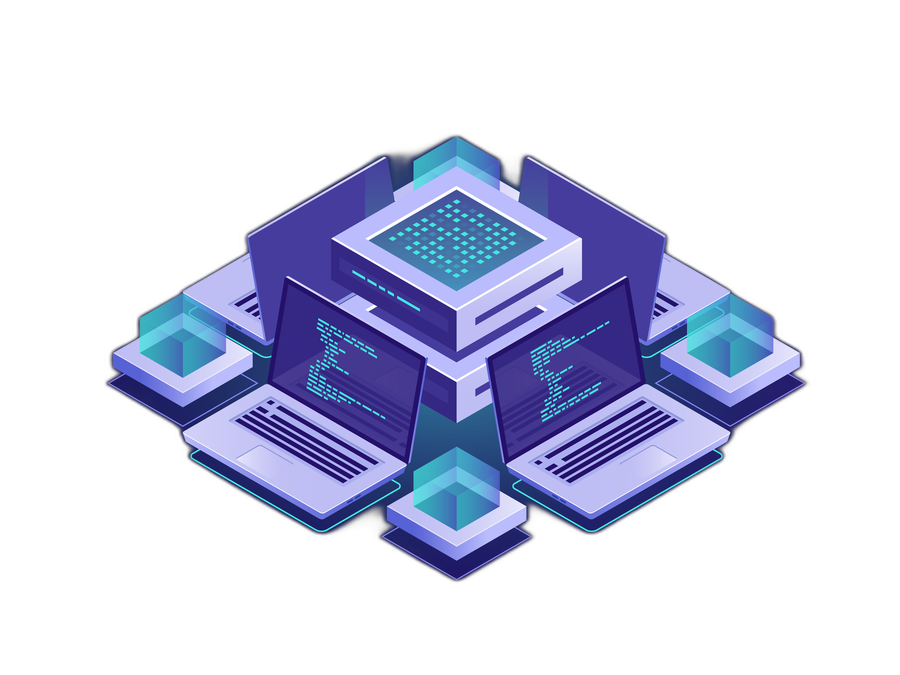

# 👋 Olá, eu sou a Bruna Custódio Alves!

)

📊 **Junior Data Analyst** na Tech For Humans, com foco em analytics engineering e pipelines de dados. 
🎓 Bacharelanda em Engenharia da Computação pela **UNIFEI** (2021 – 2026). 
🐍 Experiência com SQL, Python, Databricks, Apache Spark e Power BI, construindo processos de ETL e dashboards para apoiar decisões de negócio. 
🌱 Também fui membro do **PETTEC** (Programa de Educação Tutorial em Tecnologia para Eletrônica e Computação), onde já ensinei Python, desenvolvi um app em React Native e um projeto de IoT com ESP32/LoRa. 

 

## 💼 Experiência

**Tech For Humans** — *Junior Data Analyst* (mar/2025 – atual) 
ETL, SQL e Python para processamento de dados, dashboards e KPIs em Power BI, Databricks/Apache Spark para dados em larga escala, cerimônias ágeis com Azure DevOps e Jira.

**Tech For Humans** — *Data Analyst Intern* (jan/2024 – mar/2025) 
Extração, transformação e validação de dados, manutenção de pipelines no Databricks, relatórios e dashboards em Power BI.

**PETTEC** — *Membro* (abr/2022 – jul/2026) 
Ensino de Python para graduandos, desenvolvimento de app mobile (React Native), software de diagramação e balança inteligente IoT (ESP32 + LoRa).

## 🛠️ Tecnologias & Ferramentas

**Dados & Analytics:** SQL, Python, Databricks, Apache Spark, Power BI, ETL, Data Modeling, Data Engineering, PostgreSQL 
**Dev & Colaboração:** Git, Azure DevOps, Jira, React Native, IoT (ESP32, LoRa) 
**Linguagens (projetos acadêmicos):** Java, C, C++

## 📚 Projetos Acadêmicos

[ecot12_yanomami_persistence](https://github.com/brunacustoodio/ecot12_yanomami_persistence) — Persistência de objetos com Hibernate/MySQL, tema Povos Yanomami (ECOT12). 
[ecom06_analisador_lexico_sintatico](https://github.com/brunacustoodio/ecom06_analisador_lexico_sintatico) — Analisador léxico e sintático (linguagem ZeBru) com Flex e Bison (ECOM06 Compiladores). 
[mfc_orbita_sol_terra_lua](https://github.com/brunacustoodio/mfc_orbita_sol_terra_lua) — Simulação animada Sol-Terra-Lua em C++ com MFC. 
[jogo_freecell_c](https://github.com/brunacustoodio/jogo_freecell_c) — Jogo FreeCell em C com listas encadeadas.

## 🎓 Formação Acadêmica

**Universidade Federal de Itajubá** — Bacharelado em Engenharia de Computação (2021 – 2026)

## 📜 Certificações

Introdução à Inteligência Artificial 
Introdução à Cibersegurança 
Fundamentos em Python 
Transformação Digital para Engenheiros 
Python para Processamento de Linguagem Natural (Curso de Extensão Universitária)

## 📫 Contato

📧 Email: [bruna.custo27@gmail.com](mailto:bruna.custo27@gmail.com) 
💼 LinkedIn: [linkedin.com/in/brunacustoodio](https://www.linkedin.com/in/brunacustoodio/)

> "Sem dados, você é só mais uma pessoa com uma opinião." – W. Edwards Deming
